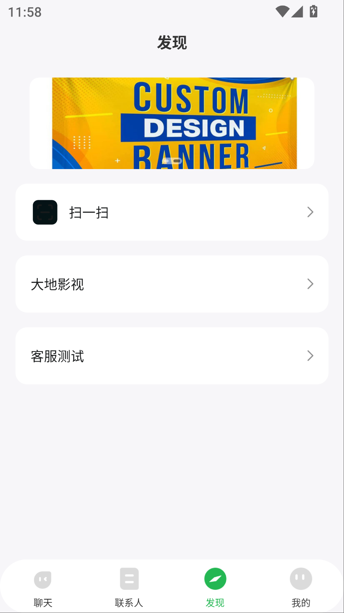

 ### 采购功能模块
 
| 模块名称 | 简介| 源码价格| 
| -- | -- | -- |  
| 收藏模块 | 可对文本消息，图片消息消息进行收藏 | 0.2w |
| 文件模块 | 选择文件发送给群或好友 | 0.8w  |  
| 群高级功能 | 支持群禁言，群管理添加，群头像设置，开启群成员邀请机制等等 | 0.88w |  
|小视频模块|录视频，发送小视频消息，播放小视频 |0.88w|
|旗舰模块|消息已读未读，消息点赞，截屏消息，图片编辑等等|1.8w|
|-|-|合计 4.56w|

### 移动端需要新增功能
- [ ] 注册登录提示语需显示管理后台设置的规则
- [ ] 注册登录背景内容须有按管理后台设置的规则和内容显示
- [ ] APP打开时需有线路自动匹配和自动切换
- [ ] 注册方式分为三种,1普通账号密码注册 2邀请码注册 3游客免注册登录
- [ ] 导航栏需加一个发现入口，顶部显示banner，下面是管理后台设置的快捷入口
- [ ] 客服上下班聊天提示

竟品发现页

