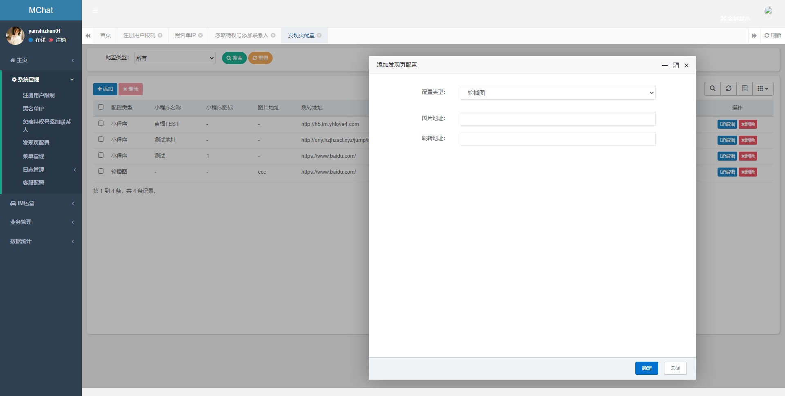
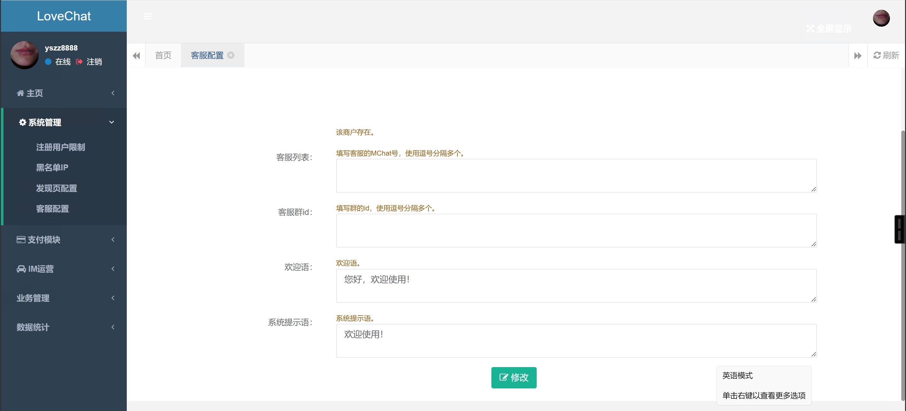

 ### 采购功能模块
 
| 模块名称 | 简介| 源码价格| 
| -- | -- | -- |  
| 收藏模块 | 可对文本消息，图片消息消息进行收藏 | 0.2w |
| 文件模块 | 选择文件发送给群或好友 | 0.8w  |  
| 群高级功能 | 支持群禁言，群管理添加，群头像设置，开启群成员邀请机制等等 | 0.88w |  
|小视频模块|录视频，发送小视频消息，播放小视频 |0.88w|
|旗舰模块|消息已读未读，消息点赞，截屏消息，图片编辑等等|1.8w|
|-|-|合计 4.56w|

### 移动端需要新增功能
- [ ] 注册登录提示语需显示管理后台设置的规则
- [ ] 注册登录背景内容须有按管理后台设置的规则和内容显示
- [ ] APP打开时需有线路自动匹配和自动切换
- [ ] 注册方式分为三种,1普通账号密码注册 2邀请码注册 3游客免注册登录
- [ ] 导航栏需加一个发现入口，顶部显示banner，下面是管理后台设置的快捷入口
- [ ] 客服上下班聊天提示
***
竟品发现页

### PC端需要新增功能
- [ ] PC端可直接加对方好友，无需验证
- [ ] 群管理指定某群成员禁言
- [ ] 群聊/单聊，没有对撤回消息、禁言、踢人、解散等灰色提示语的开关设置（可设置全体不可见/群成员不可见/仅群管理可见/对方可不见）
- [ ] 群缺少群成员列表管理页（主要用在多人群中，快速查找人员，如有备注群成员名称时，需能按备注名称快速查找）
- [ ] 管理后台缺少渠道管理模块（渠道账号管理/渠道推广用户/渠道下载、注册[数据统计页面]）
- [ ] 用户注册后缺少默认好友**客服**（当平台指定多个平台客服号时，需按指定规则自动分配，且须有首次自动发送默认欢迎语）

### web管理端定制需求
1. 管理后台缺少渠道管理模块（数据大盘（数据来源、今日注册人数、今日点击次数、昨日注册人数、昨日点击数、7日注册人数、7日点击数、总注册人数、总点击数）、渠道账号管理/渠道推广用户/渠道下载、注册[数据统计页面]）
2. 用户注册后缺少默认好友[客服]（当平台指定多个平台客服号时，需按指定规则自动分配，且须有首次自动发送默认欢迎语）
3. 发现页管理模块（ID、名称、图标、地址、添加时间、操作）
4. 

5. 用户列表需显示：是否游客/全服通知发送/拉入群聊
6. 用户管理需增加删除用户/踢线（踢出登录）
7. 客服管理模块，客服列表、客服接待对应客户列表、客服招呼语设置、客服上下班管理
8. 

9. 多线路管理与线路检测、
10. 注册用户限制管理列表（同IP，同设备，操作）
11. 黑名单注册管理
12. 
13. 设置模块：
>踢线提示控制开关、
踢线提示内容、
系统欢迎词设置、
定时弹出开关、
定时时间配置、
定时弹窗内容、
添加好友控制开关、
添加好友模式（仅添加客服号|添加好友请求次数、开放式）、
用户搜索开关、
用户搜索（仅ID|仅登录账号|不限制）、
添加好友验证开关、
客服号添加好友免验开关、
禁止删除好友开关、
删除好友限制（仅好友|全部）、
撤回消息按钮开关、
撤回消息限制（仅用户|全部）、
是否开启PC端撤回消息时间控制、
PC端撤回消息时间可控时间限制（默认不限制|N分钟内）
是否限制登录PC端（开启后，只允许平台客服号登录）、
客服号IP限制（开启后需有IP输入口，非白名单IP无法登录）、
管理后台IP限制（仅白名单IP才有权限登录管理后台）、
投诉举报按钮开关、
是否可以搜索群号加群开关、
用户群人数是否显示开关、
用户群是否显示群成员开关、
群是否显示群ID开关、
是否显示假的群人数开关（开启后需有假人数输入口）
是否允许普通群成员退群、
是否允许群主清屏、
是否显示邀请入群提示、
是否允许普通用户查看群消息、
是否群成员只显示群管理、
普通用户消息频率限制（开启后，需有发送消息时间间隔输入口，如1000毫秒）、
普通成员消息字数限制（开启后，需有消息字符限制输入框，如300字符）、
是否开启聊天记录搜索、
用户端聊天记录显示时长、
消息列表时间标注间隔（聊天串口中，每隔指定时间后自动标注时间）、
拉黑按钮开关（关闭后，仅客服号显示）
IP和设备号注册频率、
IP和设备号注册限制时长、
错误登录次数、
注册IP白名单（白名单IP不限制注册次数）、
注册IP黑名单（黑名单IP限制注册）、
是否开放游客登录、
是否开放PC端注册、
移动端注册是否显示邀请码输入口、
邀请码是否必填、
是否提示移动端用户设置头像和昵称、
默认用户头像、
群聊/单聊，撤回消息、禁言、踢人、解散等灰色提示语的开关设置（可设置全体不可见/群成员不可见/仅群管理可见/对方可不见）
